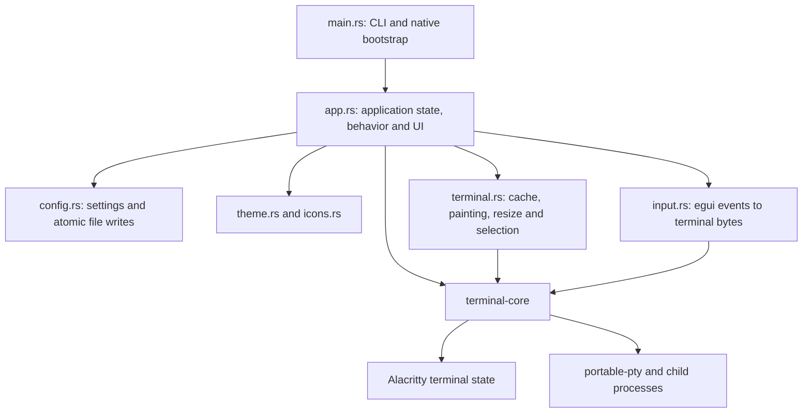
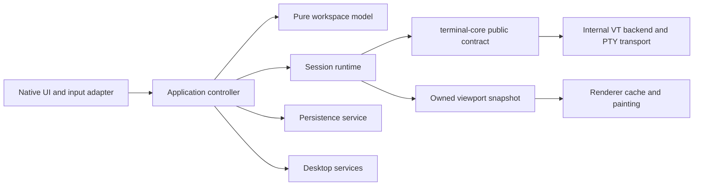

# Architecture review: scalability and agent-friendly development

Reviewed on 2026-09-30 against the supplied source tree.

The findings and line references below describe the pre-refactor tree. The
[implementation appendix](#implementation-appendix-2026-09-30) records the new
owners and validation paths; use it when navigating the current source.

## Assessment

Pace has a sound starting architecture: one native desktop application and a UI-independent terminal session crate. Keep that shape. The next investment should be explicit ownership of application state, terminal access, and side effects, followed by smaller modules around those responsibilities.

The main constraint is change coupling. Adding a workspace feature, changing terminal behavior, or improving automation often requires understanding and editing the same application file. Smaller files alone will not resolve that: modules need narrow interfaces and rules about who may change state.

Scalability here has three meanings: supporting more panes and output without degrading responsiveness; accommodating more features and platforms; and allowing developers or agents to make independently testable changes. The recommendations address all three.

## Scope and verification

I examined the manifests, all application modules, the terminal session/worker implementation, shell-integration code, unit and PTY test coverage, inspection client, Python verification tools, architecture/performance documentation, and CI/release workflows.

Fresh verification on Linux with Rust 1.97.1:

- `cargo test --workspace --all-features --locked`: **51 passed**: 25 application tests, 2 inspection-client tests, 10 core unit tests, and 14 Unix PTY tests.
- `cargo fmt --all -- --check`: passed.
- `cargo clippy --workspace --all-targets --all-features --locked -- -D warnings`: passed.

Windows ConPTY tests are platform-gated and ran zero tests on this host. I did not rerun native GUI workflows or performance benchmarks, and did not verify macOS/Windows runtime behavior. Findings about scale are based on implementation structure, not newly measured performance regressions. The supplied directory has no Git metadata, so this review does not include change-history or churn analysis. Application source was not changed for this review.

## Current architecture



The desktop package contains two binary targets and no library target. `terminal-core` is a separate library, but exposes the underlying Alacritty types and a mutable terminal lock. The visible viewport is copied by the desktop renderer rather than obtained through a core-owned snapshot contract.

The largest files are `src/app.rs` at 2,398 lines and `crates/terminal-core/src/lib.rs` at 1,742 lines, including inline tests. Their size is a symptom of several responsibilities sharing ownership:

| Component | Responsibilities currently combined |
| --- | --- |
| `app.rs` | Workspace/split model, runtime sessions, persistence DTOs, restore, commands, keyboard routing, search, dialogs, chrome, frame scheduling, screenshot handling, shutdown |
| Core `lib.rs` | Session API, child startup, reader/writer/parser workers, shared synchronization, limits, Unix/Windows lifecycle, events, palette, OSC 7, OSC 133, tests |
| `terminal.rs` | Geometry, PTY resize, viewport extraction, color conversion, row hashing, text layout, drawing, selection changes, IME overlay |

### Foundations to preserve

- PTY reading/writing/parsing happen outside ordinary frame processing. Input and output queues are bounded, and reader buffers are pooled.
- Parsing releases the grid lock between 16 KiB slices. Text shaping already happens after releasing that lock.
- Repaint notifications are coalesced, with lifecycle/metadata wakeups for hidden panes. Tests cover acknowledgement ordering and final-frame delivery.
- Rendering retains unchanged row layouts; tests check cache reuse, changed-row layout, DPI invalidation, and Unicode highlight columns.
- Persistence uses atomic replacement, with meaningful failure/concurrency tests. Improve scheduling and schema ownership while retaining these guarantees.
- There are real PTY tests and dedicated ConPTY fixtures, plus an opt-in native inspection feature and semantic GUI verification scripts.
- The documentation distinguishes parser performance from end-to-end behavior and records platform verification gaps.

## Prioritized improvements

P1 means high value for the next architectural iteration; P2 means a follow-on improvement. Effort is relative to this repository, not a delivery estimate.

| # | Recommendation | Priority | Effort | Primary benefit |
| --- | --- | --- | --- | --- |
| 1 | Extract a pure workspace/application model | P1 | Medium | Local reasoning, headless tests, feature growth |
| 2 | Route behavior through explicit commands and effects | P1 | Medium–large | Consistent behavior and bounded change scope |
| 3 | Seal terminal state behind project-owned APIs | P1 | Large, incremental | Engine isolation and enforced invariants |
| 4 | Move blocking application work out of frames | P1 | Medium–large | Responsiveness under startup, save and search load |
| 5 | Introduce a session manager and aggregate resource policy | P1 | Medium | Many-pane behavior and reliable lifecycle |
| 6 | Split UI and core implementations into cohesive modules | P1 | Medium | Navigation and lower edit contention |
| 7 | Separate and version persisted state | P1 before schema changes | Medium | Safe evolution and recoverable restoration |
| 8 | Make input routing explicit and encoding framework-independent | P2 | Medium | Platform correctness and replayable tests |
| 9 | Add incremental viewport extraction and renderer ownership | P2 | Medium–large | Lower work per changed pane |
| 10 | Isolate desktop/platform services | P2 | Small–medium | Cross-platform work and deterministic tests |
| 11 | Expand headless application and contract tests | P1 | Medium | Fast, credible validation for agents |
| 12 | Make native automation isolated and addressable | P1 | Small–medium | Independent reproducible verification |
| 13 | Document and enforce module ownership for agents | P1 | Small | Smaller context requirements and safer edits |
| 14 | Make diagnostics and builds reproducible | P2 | Small–medium | Evidence-based scaling decisions |

### 1. Extract a pure application model

**Evidence:** [app.rs:25](../src/app.rs#L25) defines the split tree, panes, workspaces and persistence structures. A `Pane` owns both `TerminalSession` and render `Cache`; [App:129](../src/app.rs#L129) combines these with configuration, search, overlays and launch/runtime bookkeeping.

Move the workspace tree and its operations into a module that depends on neither `egui` nor a real PTY. It should own workspace order, pane membership, active identities, split structure, names, and explicit lifecycle state. Keep render caches and live session handles in desktop/runtime storage keyed by pane identity.

Introduce `PaneId`, `WorkspaceId`, and, where useful, `SplitId` newtypes. Workspace identity is currently a vector index; pane identity is a raw `u64`; orientation is a boolean. Divider widget identity is derived from a node's memory address at [app.rs:1864](../src/app.rs#L1864), which makes identity depend on allocation/tree replacement rather than the logical split. An `Axis` enum is easier to interpret and harder to misuse than `Split(true)`.

Enforce invariants in the model: every layout leaf names an existing pane exactly once; the active pane belongs to its workspace; removal preserves a valid focus target; limits are checked consistently. Maintain a separate ordered workspace collection and lookup storage only when needed; changing every `Vec` into a map is not the central improvement.

**Completion criterion:** split, close, focus, rename and restore validation can be exercised without `eframe::CreationContext`, fonts, a GPU, or spawning a shell. The UI cannot construct an invalid workspace by directly changing its fields.

### 2. Use one command path and explicit effects

**Evidence:** [Action/do_action](../src/app.rs#L405) is a useful beginning, but sidebar selection directly assigns `self.active` at [866](../src/app.rs#L866), Ctrl+Tab does so at [598](../src/app.rs#L598), preferences mutate configuration directly at [910](../src/app.rs#L910), and dividers directly change the layout at [1827](../src/app.rs#L1827).

Expand this into typed commands with explicit targets: `SelectWorkspace(WorkspaceId)`, `SplitPane { workspace, pane, axis }`, `SetSplitRatio { split, ratio }`, `RestartPane(PaneId)`, and `UpdatePreferences(...)`. Widgets and keyboard shortcuts should emit commands, and the same dispatcher should apply their behavior.

Separate model changes from effects such as starting a session, writing bytes, saving state, changing the clipboard, or requesting window operations. A small coordinator can execute effects and deliver completion events. This does not require a general event bus or an event-sourcing system.

Existing paths already demonstrate why consistency matters: sidebar selection resets the search origin, whereas Ctrl+Tab does not; the pane-focus action sends terminal focus reports and releases a held mouse button, whereas workspace selection follows separate paths. Split/focus actions also have different immediate save behavior from close/toggle/rename actions. These are source-level observations; add regression tests before changing their behavior.

Use stable targets rather than resolving "the active pane" later. A queued command or asynchronous result should still identify the pane intended when it was created. A session generation can reject completions from a previous session after restart or close.

**Completion criterion:** performing an operation by shortcut, sidebar, palette, or inspection produces the same model transition and effects. UI code does not mutate durable model fields directly.

### 3. Make terminal-core a real abstraction boundary

**Evidence:** [core lib.rs:8](../crates/terminal-core/src/lib.rs#L8) re-exports Alacritty, and [lock():545](../crates/terminal-core/src/lib.rs#L545) returns a mutable `Term<EventProxy>` guard. Alacritty types enter application search, input modes, colors, coordinates, renderer cells, and selection. The UI bypasses existing core selection helpers at [terminal.rs:474](../src/terminal.rs#L474) and implements search directly at [app.rs:1149](../src/app.rs#L1149).

This creates two costs. Terminal invariants and revision notifications can be bypassed by callers, and a backend change would affect much of the desktop application. The planned engine adapter in the architecture document still needs an application-owned interface to become a contained substitution.

Add project-owned types for grid coordinates, input modes, colors/attributes, cursor state, selection ranges, terminal events, and viewport snapshots. Add semantic operations for clearing history, selection, focus reporting, and search. Keep the Alacritty mapping internal. Return an owned or safely shared visible snapshot, with a revision captured consistently alongside its state. Give event consumption an explicit runtime owner: the core exposes `drain_events()` for optional clipboard events, but no application caller currently drains it. Define which events are supported and how their bounded-queue delivery or dropping works.

Move callers incrementally. First centralize mutations through methods already present, adding missing operations. Then replace public backend types and viewport access. Remove or restrict `lock()` only after the renderer and tests have migrated.

Keep `TerminalSession` concrete initially. Introduce a narrow interface at the application/runtime seam for fakes; add a backend trait only when a second backend or another demonstrated requirement justifies it. Avoid copying the entire Alacritty API into a new facade.

**Completion criterion:** application model, command handling and input protocol logic need no Alacritty imports. Backend internals cannot be mutated by UI code, and renderers never receive a mutex guard.

### 4. Remove blocking work from interactive frames

**Evidence:** startup/restore call `TerminalSession::spawn` synchronously at [app.rs:251](../src/app.rs#L251) and [300](../src/app.rs#L300). That method opens a PTY, starts a process, allocates terminal state and starts workers before returning. [save_state:372](../src/app.rs#L372) serializes and writes synchronously; the underlying atomic writer performs file/directory synchronization at [config.rs:104](../src/config.rs#L104). Preferences can repeat this on changed frames. [find_next:1138](../src/app.rs#L1138) recompiles the query and searches while holding the grid lock, including when the search field changes.

Use bounded application workers for startup and persistence. Represent panes as `Starting`, `Running`, `Closing`, `Exited` or `Failed` in the application lifecycle, so restoration can populate the UI before every shell finishes starting. Limit simultaneous spawns.

For persistence, send immutable snapshots to one writer, coalesce superseded snapshots, and acknowledge the saved generation. Retain atomic replacement and explicit error reporting. Flush the latest pending snapshot at an intentional shutdown boundary. A background writer must not allow an older snapshot to overwrite a newer one.

Compile search queries when they change. Give search a time/row budget or cancellable incremental execution; moving an unlimited scan to another thread still stalls parsing if it retains the grid lock throughout. Tag results with pane/session/query identity so stale results cannot affect a different pane.

**Completion criterion:** slow storage, several restored shells, or a large-history query cannot freeze input/chrome. Queues remain bounded, outdated work is coalesced/cancelled, and failure appears against the correct operation.

### 5. Give a session manager ownership of resource policy and lifecycle

**Evidence:** session counts are checked in [spawn:300](../src/app.rs#L300), workspace counts in [add_workspace:333](../src/app.rs#L333), and per-workspace panes in [do_action:425](../src/app.rs#L425). There are limits of 24 workspaces, 12 panes per workspace and 64 panes total. The core creates three workers per session at [431](../crates/terminal-core/src/lib.rs#L431) and enforces a per-session logical cell budget at [691](../crates/terminal-core/src/lib.rs#L691). Shutdown is requested nonblocking, while application exit polls worker counts for two seconds at [app.rs:2115](../src/app.rs#L2115).

At the current pane ceiling, live sessions can account for 192 reader/writer/parser workers, before GUI threads or temporary ConPTY-close workers. Each session has its own queues, terminal history and periodic liveness/I/O waits. That is a scaling consideration, not evidence that the existing implementation is already too slow.

Introduce `SessionManager` to own sessions, pending spawns, generations, closing sessions, and shutdown completion. Centralize count limits and aggregate history/queue/cache resource accounting. The 16-million-cell guard is useful, but it is per session and not a strict byte/RSS limit; aggregate policy must account for several sessions and extra allocations.

Make restart a replacement operation rather than another ordinary spawn: currently it invokes the same full-capacity check before replacing the old pane. Keep closing sessions in resource accounting until teardown completes, even after they disappear from the workspace model.

Do not immediately replace portable-pty or rewrite everything around an async runtime. Measure 1/8/32/64-pane idle and output behavior first. If polling or worker overhead dominates, the new runtime boundary is the place to introduce a shared scheduler or platform-specific reactor while preserving VT and shutdown contracts.

**Completion criterion:** one service defines resource limits, restart/restore respect them, shutdown can report completion, and rapid close/reopen does not make resource accounting forget in-flight teardown.

### 6. Split modules around responsibilities and visibility

Move workspace logic, persistence and application coordination out of `app.rs`; split the view into titlebar/sidebar/workspace/dialog/settings components. Keep widgets on typed view data plus emitted commands. Avoid passing `&mut App` to every extracted widget, which would preserve the same coupling under different filenames.

Within `terminal-core`, separate the public session API, shared runtime state, reader/writer/process orchestration, backend mapping, event handling, limits, OSC 7 tracking and prompt integration. Keep platform-specific I/O/lifecycle implementations in a platform subtree.

Use private fields and `pub(super)`/`pub(crate)` intentionally. Provide invariants and threading expectations at module entry points. A file-size target is a maintenance signal, not an architecture rule; do not split coherent functions merely to satisfy a line count.

Keep existing `theme` and `icons` boundaries. Font discovery has a different responsibility from theme style and can move to platform/font services when that area is next changed.

**Completion criterion:** an agent working on workspace behavior normally reads the model, command interface and relevant tests; an agent changing paint code normally reads the viewport contract and renderer; neither needs the full application implementation.

### 7. Own and version the persistence schema

**Evidence:** [SavedState/SavedWorkspace](../src/app.rs#L82) live beside runtime structures and serialize the same `Node` enum used by the UI. There is no schema-version field. [startup restoration:225](../src/app.rs#L225) silently skips unreadable/unparseable state and invalid directories, then saves the resulting current state at [248](../src/app.rs#L248).

Create separate persisted DTOs and an explicit versioned envelope, with conversion/migration into validated model state. Keep a fixture for the current unversioned format. Preserve unreadable/corrupt state for diagnosis before replacing it, and report restoration failures or skipped entries with useful context. Distinguish an unsupported future version from a broken file.

Make persistence policy explicit: which changes mark state dirty, when debouncing happens, and what is guaranteed on exit. Derived serialization of a runtime enum should not determine the compatibility contract accidentally.

Configuration is already independently typed and rejects unknown keys. Retain typo detection, while treating future configuration changes as intentional compatibility decisions.

**Completion criterion:** renaming internal model types does not silently break saved workspaces; old fixtures migrate; corrupt/newer formats produce visible diagnostics without destroying the original file.

### 8. Separate input ownership, event normalization and byte encoding

**Evidence:** [input.rs:19](../src/input.rs#L19) uses `egui::Key`/`Modifiers` and Alacritty modes. Its encoding routines are largely functional and have nine tests, which is a good foundation. Ownership policy is spread across shortcuts, the modal booleans checked at [app.rs:2058](../src/app.rs#L2058), terminal routing, and pointer selection in painting.

Define explicit routing contexts: an overlay, text field, terminal search field, or a targeted terminal pane owns the event. Normalize framework events into project-owned key/text/IME/pointer events before encoding. Preserve layout-produced Unicode text and physical information when available; an abstraction cannot recover keypad/lock/layout information that the framework does not supply.

Retain the existing AltGr, paired Text suppression, legacy Ctrl+C/Ctrl+V, Kitty modes and release/repeat tests. Add routing-level event-sequence tests, because correct byte encoders alone do not prove correct ownership.

Replace mutually exclusive overlay booleans with an `OverlayState` enum carrying appropriate data. Search state and persistent panes can remain separate; do not force every UI condition into one global enum.

**Completion criterion:** recorded event sequences prove exactly-once delivery and clear ownership without opening a native window or depending on modal drawing order.

### 9. Separate renderer preparation, painting and interaction

**Evidence:** [Cache::paint:115](../src/terminal.rs#L115) computes geometry, calls `session.resize`, extracts cells, hashes/shapes rows, paints and updates selection. It reads the complete visible content when the terminal revision changes, then uses row hashes to avoid reshaping unchanged rows. Hash caching saves layout work; it does not eliminate full viewport extraction on each changed revision.

Give geometry calculation its own pure operation. The pane controller should request a resize when desired cell/pixel geometry changes. The core must preserve the current grid-before-PTY notification ordering tested by the PTY suite; extracting resize from paint is not permission to reorder it.

Let renderer preparation consume a viewport snapshot and produce/update draw data. Let painting consume that draw data and return interactions. Keep text galleys/font caches renderer-owned and IME/pointer state interaction-owned.

After measuring extraction cost, add dirty-row information or shared immutable row snapshots from the engine adapter. Apply complete invalidation on scroll/reflow, font/DPI/theme changes and session replacement, with separate cursor/selection damage where appropriate. Keep the existing cache correctness tests and add adapter contract tests.

**Completion criterion:** painting receives no live session handle. A one-row terminal change does not require reshaping other rows, and eventual extraction work can scale with damage when measurements justify it.

### 10. Isolate desktop and platform services

**Evidence:** clipboard access is performed directly in a context-menu callback at [app.rs:1733](../src/app.rs#L1733); fonts are discovered/read while building theme definitions at [theme.rs:144](../src/theme.rs#L144). Linux cwd polling is embedded in the core engine loop at [lib.rs:972](../crates/terminal-core/src/lib.rs#L972), alongside ConPTY lifecycle branches.

Give clipboard, font discovery and window operations small service boundaries or focused modules. Provide deterministic substitutes for application tests. Keep Linux `/proc` cwd discovery separate from portable OSC 7 tracking, and Unix interruptible I/O separate from ConPTY teardown.

Use ordinary functions/concrete types for services that have only one implementation; a trait is helpful where platform substitution or tests actually need it. Keep platform details in the desktop/runtime layers rather than in the pure workspace model.

**Completion criterion:** a clipboard or font fallback change has a clear owner, and tests can establish expected behavior without the developer's installed fonts or clipboard contents.

### 11. Add application and boundary tests where coverage is thin

**Evidence:** [app.rs tests:2353](../src/app.rs#L2353) contain three helper tests: layout validation, split removal and Unicode labels. There are strong core/renderer tests, but no comparable headless command/controller suite. Renderer tests currently require Unix PTYs at [terminal.rs:503](../src/terminal.rs#L503).

Build a small fake session runtime that can return metadata/snapshots and record intended effects. Test the real model/controller against it: workspace/pane selection, closing before/at/after the active workspace, focus reports, restart at capacity, failed spawns, cancel-close, restore with missing directories, stale completions, and persistence dirty/acknowledgement behavior.

Keep real PTY/ConPTY integration tests: fakes cannot establish kernel resize or process cleanup correctness. Add project-owned terminal contract tests for snapshot dimensions, revision/damage behavior, selection coordinates, input modes, events, synchronized updates and shutdown. Test rendering from synthetic snapshots across platforms, while retaining a smaller real-PTY renderer integration set.

If these boundaries are later extracted into crates, package-scoped checks become a natural fast loop. Until then, expose a library target or suitable public module surface for application integration tests. Do not duplicate implementation internals merely to increase test counts.

**Completion criterion:** an agent can validate a workspace change quickly without fonts/GPU/real shells, while the complete suite still verifies real transport/lifecycle behavior.

### 12. Make native automation independent and explicit

**Evidence:** the inspection feature is already opt-in, and `pace-inspect` supports an address argument. However, [inspect-regression.py:42](../scripts/inspect-regression.py#L42) does not pass a configurable address, restoration probes hardcode port 5719 at [243](../scripts/inspect-regression.py#L243), pane detection infers generic roles/action masks/bounds at [95](../scripts/inspect-regression.py#L95), and field identification partly depends on order. The workflow also assumes `/tmp`, Linux-style config paths and Ctrl+Shift shortcuts.

Create a run-scoped launcher/harness that owns the process, endpoint, data directory, output directory and cleanup. Add explicit data/state-root options: [App::new](../src/app.rs#L182) uses `--config` only for the settings file, while workspaces remain in the default data path. A temporary config file alone is therefore insufficient isolation for an agent's GUI run.

Carry a unique/configurable inspection endpoint throughout the client, probe and relaunch paths. Expose stable accessible pane/field identities instead of inferring them from position or generic action bits. Use bounded readiness/semantic-condition polling rather than treating fixed sleeps as proof of completion.

Keep a portable semantic core with platform-specific OS input adapters. Name Linux-only workflows honestly until adapted. A later developer command/snapshot interface can reuse the application commands for targeted tests, but building a new MCP server is not a prerequisite.

**Completion criterion:** separate verification runs cannot share workspace state, collide on the inspection endpoint, or drive the wrong process; scripts identify intended widgets semantically and clean up what they started.

### 13. Give agents a concise development contract

No `AGENTS.md` was present in the repository or searched ancestor paths. The existing documentation has useful renderer decisions and release evidence, but no concise map of module ownership and normal feature-change paths.

Add a short root guide covering architecture entry points, dependency direction, focused check commands, safe GUI data-root setup, and how to interpret platform test coverage. Document where changes belong and which APIs must preserve invariants. Add local guides only where rules differ, such as core threading and backend access.

Document critical contracts near their code: lock ordering, acknowledgement-before-snapshot, synchronized update handling, resize notification ordering, resource ownership and shutdown. Move long historical acceptance records into dated records and keep current operational instructions easy to find. Record durable design decisions in small ADRs when choices actually warrant them.

Enforce the important boundary with package dependencies where possible: the pure model must not depend on `eframe`, Alacritty, or portable-pty. Use Rust visibility for the remaining boundaries. Automated checks are more reliable than expecting every agent to remember prose.

**Completion criterion:** a new agent can locate the owner of a change and its minimum validation without reading all application/core code; violating a key dependency rule fails compilation or a focused architecture check.

### 14. Expose diagnostics and make verification reproducible

**Evidence:** [SessionMetrics](../crates/terminal-core/src/lib.rs#L94) records byte counts, parser time, revision and worker counts; application frame count/time are updated but have no useful diagnostic consumer. CI uses moving `stable` at [.github/workflows/ci.yml:33](../.github/workflows/ci.yml#L33), while manifests declare minimum Rust versions of 1.95 for desktop and 1.88 for core. All-feature lint/tests do not separately execute the normal default-feature test configuration.

Add structured, opt-in diagnostics keyed by workspace/pane/session generation: spawn/cleanup durations, queue saturation, error kind, snapshot/lock time, cache/extraction work, frame-time distributions and resource counts. Do not log terminal contents by default. Expose expected errors as typed categories such as backpressure, closed session, invalid geometry, spawn failure and persistence failure; preserve detailed causes for diagnosis.

Add reproducible many-pane scenarios for idle, one busy visible pane, several busy panes, hidden output and rapid lifecycle operations. Record p50/p95/p99 frame and latency measurements separately from parser throughput. Profile before changing the I/O scheduler or renderer.

Pin a development toolchain and explicitly test promised minimum versions, or update the promises. Keep a stable/latest compatibility job if useful. Verify both default and inspection configurations. Upload GUI/performance artifacts with build/config/platform metadata where those workflows run, so another developer or agent can reproduce the observation.

**Completion criterion:** architectural performance decisions have repeatable evidence, ordinary failures retain operation/pane context, and a successful check clearly identifies its compiler, features and platform scope.

## Suggested destination

Start with modules in the desktop package and retain the current core crate. Extract the pure model into a third package once its boundary is clear. The following tree is a destination, not a proposal to create every file in one change:

```text
src/
  main.rs                   # CLI and native bootstrap
  lib.rs                    # Testable desktop composition surface
  app/
    mod.rs                  # Thin eframe adapter
    controller.rs           # Commands, model transitions and effect coordination
    command.rs
    ui_state.rs             # Overlays, search, interaction state
  runtime/
    sessions.rs             # Session registry, generations, limits, shutdown
    persistence.rs          # Background writer and save acknowledgements
  persistence/
    config.rs
    workspace_state.rs      # Versioned DTOs, validation, migrations
  ui/
    workspace.rs
    chrome.rs               # Titlebar/sidebar; split further when useful
    dialogs.rs
    preferences.rs
    palette.rs
  terminal_view/
    geometry.rs
    cache.rs
    paint.rs
    input_adapter.rs
  platform/
    clipboard.rs
    fonts.rs
    window.rs
  theme.rs
  icons.rs
  bin/pace-inspect.rs

crates/
  pace-model/
    src/lib.rs
    src/workspace.rs
    src/layout.rs
    src/ids.rs
  terminal-core/
    src/lib.rs              # Small public exports and contract documentation
    src/session.rs
    src/view.rs             # Project-owned viewport/coordinate types
    src/input.rs            # Framework-independent terminal input encoding
    src/events.rs
    src/limits.rs
    src/runtime/            # Shared state and worker orchestration
    src/engine/             # Alacritty mapping
    src/platform/           # Unix I/O and Windows lifecycle
    src/shell_integration/  # OSC 7 and prompt tracking
```



The model imports neither the GUI nor terminal backend. The desktop composition layer connects everything. The runtime owns processes; the renderer owns text/GPU-related cache state; persistence owns file compatibility; commands own application behavior. A viewport contract sits between terminal state and rendering.

Do not add separate crates for every widget, a plugin framework, a generic event bus, an ECS, or a daemon as part of this refactor. A separate session daemon becomes relevant only if preserving live processes across GUI restarts or supporting multiple clients becomes a product requirement. An alternate renderer/backend becomes relevant when measured behavior or a concrete feature motivates it.

## Staged refactor order

1. **Establish the model seam.** Extract IDs, split/layout operations and workspace invariants; add characterization tests for current focus/close/restore behavior. Keep existing serialized output compatible.
2. **Establish the command seam.** Route sidebar, shortcuts, dividers and preferences through targeted commands. Define effect results and session generations; give each durable mutation explicit dirty-state behavior.
3. **Separate views and lifecycle.** Extract widgets around view data/commands and introduce the session manager. Replace overlay booleans with explicit state. This is the first substantial reduction in shared-file edit contention.
4. **Seal terminal access incrementally.** Use semantic mutation methods, then project-owned input/event/viewport types. Preserve resize, repaint and synchronized-update contract tests through every step.
5. **Separate persistence and blocking effects.** Introduce schema conversion and recovery before changing format; add bounded startup, background saving and budgeted search. Verify stale-completion and failure paths.
6. **Improve the agent loop.** Add isolated native harness configuration, stable widget identities, focused checks and a concise agent guide. Expand portable synthetic-snapshot tests and retain native smoke tests.
7. **Optimize from measurements.** Measure many-pane CPU/memory/frame behavior, then decide whether incremental extraction, scheduler changes or a different renderer is warranted.

Each step should compile and preserve existing tests independently. Keep structural moves and intentional behavior changes in separate reviewable changes where practical. The first useful milestone is a headless workspace/controller layer, a narrow terminal interface, and views that emit commands: those changes make later feature work meaningfully more modular.

## Implementation appendix: 2026-09-30

The refactor implements the ownership seams from this review while retaining one
desktop application and a concrete terminal session implementation. This table
maps recommendations to current code and focused validation, rather than the
historical line numbers above.

| Recommendations | Current implementation and validation |
| --- | --- |
| 1, 2, 11 | `crates/pace-model/` contains stable newtype identities, private model/workspace fields, validated split trees, targeted commands, explicit effects, generation-tagged lifecycle and fake-runtime tests. Focus, workspace order, capacity replacement, stale results and saved-generation behavior are headless. |
| 3, 6 | `terminal-core/src/session.rs` exposes project-owned viewport/input/event/selection/search types. Backend locks/re-exports are removed; mapping, runtime, platform and shell integration have separate owners. Existing real PTY tests retain transport coverage. |
| 4, 5 | `runtime/sessions.rs` bounds startup workers and aggregate reservations through close/restart/shutdown. Bootstrap loads settings/state on a worker; bounded pending actions replay after loading, and launch commands retain the original pane/generation. Budgeted, cancellable search avoids unlimited locked scans. `runtime/persistence.rs` provides two coalescing snapshot slots, 75 ms debounce, per-destination generations, acknowledgement/error events and bounded intentional flushing. |
| 7 | `persistence/workspace_state.rs` owns a version-1 DTO independently of runtime layouts and migrates the checked-in unversioned fixture. Missing/invalid entries have diagnostics; corrupt/lossy recovery preserves original bytes before replacement, and unsupported/unreadable files block workspace saving. Preferences retain independent validation/writes. |
| 8, 10 | `app/input.rs` and the egui adapter normalize explicit routing ownership; terminal-core encodes framework-independent key/text/pointer protocols. `OverlayState` makes modal ownership explicit. `platform/` contains clipboard, fonts and window operations. |
| 9, 11 | `terminal_view/` separates pure geometry, snapshot cache preparation and painting/interactions. Rendering receives snapshots, with shared unchanged row data and full invalidation rules. Synthetic snapshot tests complement real-PTY renderer fixtures. |
| 12 | `--data-root` isolates settings and workspaces. `native-harness.py` owns a unique endpoint/data/output/process, carries them through relaunch and polls semantic readiness. Explicit pane/field accessibility labels replace positional identity. The POSIX shell regression and Linux/X11 OS-input adapter identify their platform scope. |
| 13 | Root and crate-local `AGENTS.md` guides document owners, threading/resize/repaint/shutdown contracts and focused checks. `scripts/check-architecture.py` rejects model runtime dependencies, desktop backend/lock access and production renderer live-session handles; its self-tests verify rejection. |
| 14 | The development toolchain is pinned, default and inspection checks are separate, diagnostics use operation/pane/generation context, and run-scoped resource scenarios retain build/platform metadata. Timings/resource accounting remain distinct from claims about GPU presentation or comparative terminal speed. |

Focused checks live in the owning [agent guides](../AGENTS.md);
[verification.md](verification.md) records CI coverage and release procedures.
Passing headless tests does not establish
native macOS/Windows, IME, clipboard or GPU performance acceptance. Preserve
those platform gates and record fresh native artifacts for the refactored build.

All 14 recommendations are implemented. The Linux verification record contains
125 default-feature tests, 127 inspection-feature tests, the native workflow,
and accepted 1/8/32/64-pane scenarios with complete teardown. Error diagnostics
retain operation, pane, generation and failure category without logging input
or terminal contents. Platform scope and measurement limits are recorded with
the results rather than inferred from configured CI jobs.
